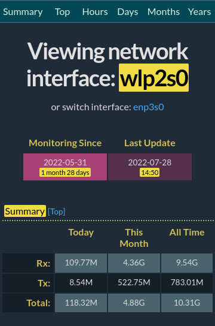

A simple PHP script to display [ vnstat ](https://github.com/vergoh/vnstat)
network bandwidth statistics in HTML table format. Requires PHP's shell_exec()
and exec() functions enabled. Uses [ watercss
](https://github.com/kognise/water.css) for styling the output.

